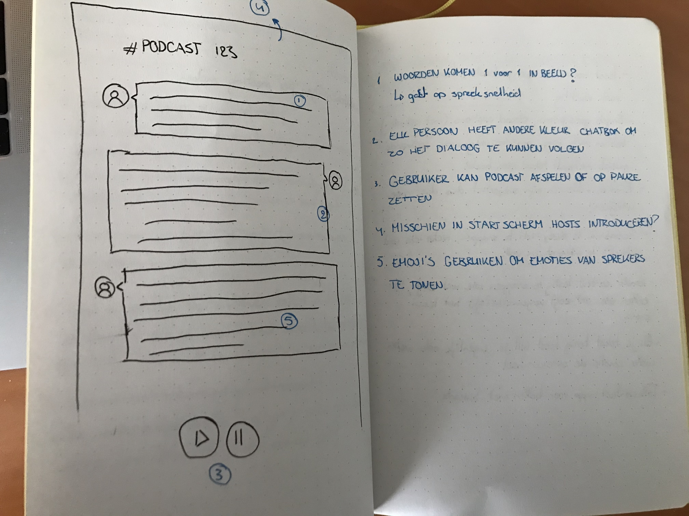

# Web design 19-20
> Building an application for one specific user and one specific context to understand how to build applications for people who are excluded by some defaults.

## About the test person: Marie
Marie identifies herself as Deaf, that does not only mean that she's litteraly deaf and can't hear anything but it also means that Dutch sign language is her natural language. Marie is an interaction designer at VPRO which makes it easier for me to ask design related questions.

## Headlines from the user tests / interviews
### Test 1

The first test / interview was all about getting to know Marie. Here are some notes that stood out to me while attending the meeting:
- Unless it's very clear what colors express certain emotions you have to watch out with color-coding emotions;
- She doesn't know if she likes text to be visible all at once or word by word so that is something I'll have to build both ways for the first prototype;
- Soundwaves don't mean anything to Marie, but rythm could be something valuable (maybe show the words at speaking speed?)

And so for the second test I decided to build two minor prototypes in CodeSandbox, just to test her preference for showing text block by block or word by word. You can see them here:
1. [Showing text block by block](https://owg73.csb.app/)
2. [Showing text word by word](https://090c1.csb.app/)

### Test 2

I wanted to know what Marie preferred so therefore I created the two prototypes above, just to validate her preference.

- Marie still doesn't have a clear preference about incoming messages, I therefore chose to come up with a different solution as you can see in the image below;
- Reinier's prototype shows the whole text, but opaque, the spoken text gets an opacity of 1 when it is spoken; This way Marie can still see the whole text and also the rhythm of how something is spoken;
- Marie mostly uses her mobile so the design should be **mobile first**;
- Marie thinks a serif font reads better;
- Every new text block indicates to Marie that there's a pause in the text.

After giving the above points some thought I decided to focus mostly on intonation in a text to give Marie more of an experience what she would have if she could listen to the podcast. The design should be mobile first and use a serif font. Also I could use seperate text blocks and show the text word-by-word to make the intonation more clear to Marie.

### Test 3
This was the last test we had with Marie, so I built out a full blown version of the prototype for this one so I could get as much feedback as possible while keeping the above feedback in mind. I decided to first show the intro as text, so she could read what the podcast was all about before the conversation starts.

The final prototype looked like this:

You can find it [here](https://web-design-1920.now.sh/).

The only feedback Marie had for my prototype is that she thought it was awesome and that she learns a lot from focussing on intonation. She literally said:
> "I didn't know people spoke like that, nice."

[You can read all about the tests in the Wiki]()

## How I implemented the [*exclusive design principles*](https://exclusive-design.vasilis.nl/principles/)
### 1. Study situation
#### What is it?
You have to get a deep understanding of how a certain person uses their device and how a certain person surfs the web to build an optimal solution for them specifically instead of trying to make your website 'good' for everyone.

#### How I implemented it
At every test we had I tried to stay away from the "what do you think suits deaf people?" kind of questions. Instead I constantly tried to figure out what triggers Marie specifically and what she thinks suits **her** the best so that I could come up with a concept thats 100% suited to her and only her.

### 2. Ignore conventions
#### What is it?
We all know the conventions like having the navigation at the top and desktop and (mostly) on the bottom on mobile. But what if we ignore those conventions and come up with solutions tailor made for one person? The defaults suck for people who are excluded by them so maybe if we ignore them we can build better designs.

#### How I implemented it
Where everyone in the group who were building podcasts mostly focussed on showing emotions through color or font difference I decided to go another route and purely focus on intonation to make the podcast-experience more exciting.

### 3. Prioritise identity
#### What is it?
To make the application a one-of-a-kind experience we don't want to look it like everything else. We have to prioritise the identity of who we are designing for so we can add some of their personality to the application.

#### How I implemented it
During the first interview, Marie hinted to some kind of murder podcast she likes. So I decided that the podcast I use in the application should be something similar. Also, the whole application should have that kind of look and feel to it. Not only by design but also by how the text is displayed etc.

### 4. Add nonsense
#### What is it?
To level up the experience above just functional you can come up with nonsensical ideas instead of trying to add a bit of value for everyone. Ideas that seem nonsensical for some can add a lot of value for your specific context. Also it can just add that little bit of extra personality to an application by just adding nonsense, besides that it's just pure fun.

#### How I implemented it
At first I thought it should be clear from the start to Marie who's speaking in the podcast. But then I thought: "What if I just show the images of the persons after they are introduced in the podcast?" Since when we listen to the podcast we mostly know who's speaking after they are introduced, then we can Google them etc. So that was exactly what I did to add an extra dimension to the otherwise pretty dull text.

## Conclusion
